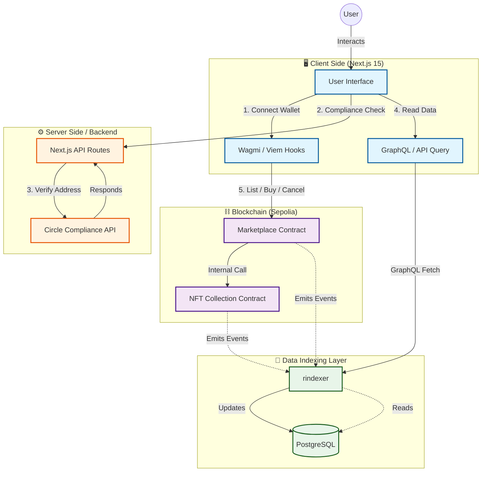
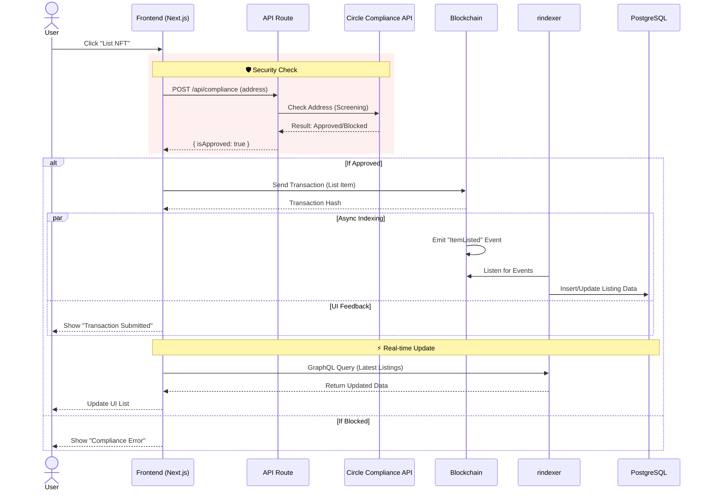

<a id="readme-top"></a>

<br />
<div align="center"\>
  <a href="https://github.com/LazyBoneJC/Neon-Marketplace">
    
  </a>

<h3 align="center"\>🔷 Neon Marketplace 🔷</h3>
   <p align="center"\>
      The next-gen platform for decentralized NFT trading.
   </p>
   <p align="center"\>
      Built with Next.js, Solidity, Foundry, and rindexer.
   </p>
   <p align="center"\>
     <a href="https://neon-marketplace.zeabur.app/">Click here to use Neon Marketplace</a>
   </p>
</div>

---


## 📖 Overview

**Neon Marketplace** is a full-stack decentralized application (DApp) that allows users to mint, list, and buy NFTs with a seamless user experience. Unlike traditional marketplaces, this project integrates a custom indexer for real-time data retrieval and utilizes a modern Web3 stack for high performance.

The platform features specific collections like **Ninja NFT**, demonstrating support for various ERC-721 token standards.

## ✨ Key Features

- **🛒 NFT Trading:** Buy and sell NFTs securely using smart contracts.
- **⚡ Real-time Indexing:** Powered by `rindexer` to fetch off-chain events instantly.
- **🤖 AI Chatbot:** Interactive assistant for market queries, NFT listing, and security checks (supports Chinese/English).
- **📊 AI Market Analyst:** Real-time AI-powered market analysis with price trends and insights.
- **🎨 Custom Collections:** Support for specific collections like Ninja NFT.
- **👛 Wallet Integration:** Seamless connection via RainbowKit & Wagmi.
- **📱 Responsive Design:** Modern UI built with Tailwind CSS.
- **🛡️ Compliance Ready:** Integrated compliance checks for safer transactions.


## 🏗️ Architecture

### System Architecture

The platform bridges on-chain integrity with off-chain performance using a custom indexing layer and secure API routes.



### Core User Flow: Listing an NFT

This flow demonstrates the integration of Compliance Checks before interacting with the blockchain, followed by Asynchronous Indexing for UI updates.



## 🤖 AI Features

### AI Chatbot

An interactive assistant accessible via the floating action button (FAB) in the bottom-right corner.

**Capabilities:**
- 💬 **Natural Language Interaction:** Ask about market trends, list NFTs, or check wallet security
- 🌐 **Bilingual Support:** Automatically detects and responds in Chinese or English
- 🔄 **Language Toggle:** Manual switch between languages in the header
- 💾 **Chat History:** Persisted locally for seamless experience
- 👛 **Wallet Validation:** Requires wallet connection for listing actions
- 🛡️ **Real Compliance Check:** Security checks call the real Circle API (even in mock mode)

**Quick Actions:**
| Action | Chinese | English |
|--------|---------|---------|
| Market Query | 查詢價格 | Check Prices |
| List NFT | 幫我上架 | List NFT |
| Security Check | 檢查 0x... | Check 0x... |

### AI Market Analyst

Real-time market analysis powered by Gemini AI, displaying insights on recent trades and price trends.

### Mock Mode

For development and demos, set `MOCK_AI=true` to use predefined responses without consuming Gemini API quota.

> **Note:** Even in mock mode, the compliance check still calls the real Circle API to provide accurate security results.

## 🛠️ Tech Stack

### Frontend

- **Framework:** [Next.js 15](https://nextjs.org/) (App Router)
- **Language:** TypeScript
- **Styling:** Tailwind CSS
- **Web3 Libraries:** Wagmi, Viem, RainbowKit

### AI & Backend

- **AI Model:** Google Gemini (`gemini-2.5-flash-lite`)
- **API Routes:** Next.js API Routes
- **Compliance:** Circle API (Address Screening)

### Smart Contracts

- **Framework:** [Foundry](https://book.getfoundry.sh/)
- **Language:** Solidity
- **Testing:** Forge (Unit & Fuzz testing)

### Backend / Indexer

- **Indexer:** [rindexer](https://rindexer.xyz/) (Rust-based EVM indexer)
- **Container:** Docker

---

## 🚀 Getting Started

Follow these steps to set up the project locally.

### Prerequisites

- [Node.js](https://nodejs.org/) (v18 or higher)
- [pnpm](https://pnpm.io/) (Recommended package manager)
- [Foundry](https://getfoundry.sh/)
- [Docker](https://www.docker.com/) (For running the indexer)

### 1. Clone the Repository

```bash
git clone [https://github.com/LazyBoneJC/Neon-Marketplace.git](https://github.com/LazyBoneJC/Neon-Marketplace.git)
cd Neon-Marketplace
```

### 2. Smart Contracts Setup (Foundry)

Navigate to the foundry directory, install dependencies, and start the local blockchain.

```bash
cd foundry
forge install
forge build

# Start local blockchain (Anvil)
anvil
```

In a new terminal window, deploy the contracts:

```bash
# Deploy to local Anvil chain
forge script script/DeployMarketplace.s.sol --rpc-url [http://127.0.0.1:8545](http://127.0.0.1:8545) --broadcast --private-key <YOUR_ANVIL_PRIVATE_KEY>
```

### 3. Indexer Setup (rindexer)

This project uses rindexer to index blockchain events. Ensure Docker is running.

```bash
cd marketplaceIndexer
docker-compose up -d
```

### 4. Frontend Setup (Next.js)

Return to the root directory and install dependencies.

```bash
# Install dependencies
pnpm install

# Start the development server
pnpm dev
```

Open http://localhost:3000 with your browser to see the result.

## 📂 Project Structure

```bash
├── foundry/              # Smart contracts (Solidity)
│   ├── src/              # Contract source code (NftMarketplace, NinjaNft, CakeNft)
│   ├── script/           # Deployment scripts
│   └── test/             # Foundry tests
├── marketplaceIndexer/   # Indexer configuration and Docker setup
├── src/                  # Frontend source code (Next.js)
│   ├── app/              # App Router pages
│   │   └── api/          # API Routes (chat, ai-analyst, compliance)
│   ├── components/       # React components
│   │   └── AI/           # AI components (AIChatbot, TransactionPreview)
│   ├── hooks/            # Custom hooks (useChatbot, useTransactionPrecheck)
│   ├── utils/            # Utilities (rindexer-client, ai-service)
│   └── ...
└── public/               # Static assets
```

## ⚙️ Environment Variables

Create a `.env.local` file in the root directory:

```bash
# AI Configuration
GEMINI_API_KEY=your_gemini_api_key    # Required for real AI responses
MOCK_AI=true                           # Set to 'true' for mock mode (no Gemini API costs)

# Rindexer (Indexer)
RINDEXER_URL=https://your-indexer-url/graphql
NEXT_PUBLIC_RINDEXER_URL=https://your-indexer-url/graphql

# Circle Compliance API
CIRCLE_API_KEY=your_circle_api_key
ENABLE_COMPLIANCE_CHECK=true           # Set to 'true' to enable address screening

# WalletConnect
NEXT_PUBLIC_WALLETCONNECT_PROJECT_ID=your_project_id
```

## 🧪 Running Tests

To run the smart contract tests:

```bash
cd foundry
forge test
```

## 📜 License

This project is licensed under the MIT License - see the LICENSE file for details.

---

Built with ❤️ by LazyBoneJC
