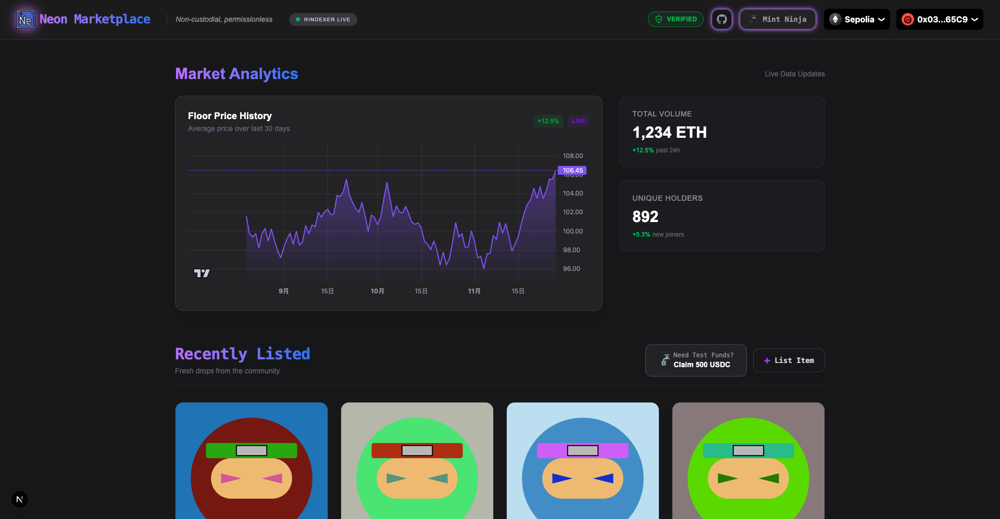

<a id="readme-top"></a>

<br />
<div align="center"\>
  <a href="https://github.com/LazyBoneJC/PrismDrop">
    
  </a>

<h3 align="center"\>🔷 Neon Marketplace 🔷</h3>
   <p align="center"\>
      The next-gen platform for decentralized NFT trading.
   </p>
   <p align="center"\>
      Built with Next.js, Solidity, Foundry, and rindexer.
   </p>
   <p align="center"\>
     <a href="https://neon-marketplace.vercel.app/">Ckick here to use Neon Marketplace</a>
   </p>
</div>

---


## 📖 Overview

**Neon Marketplace** is a full-stack decentralized application (DApp) that allows users to mint, list, and buy NFTs with a seamless user experience. Unlike traditional marketplaces, this project integrates a custom indexer for real-time data retrieval and utilizes a modern Web3 stack for high performance.

The platform features specific collections like **Ninja NFT** and **Cake NFT**, demonstrating support for various ERC-721 token standards.

## ✨ Key Features

- **🛒 NFT Trading:** Buy and sell NFTs securely using smart contracts.
- **⚡ Real-time Indexing:** Powered by `rindexer` to fetch off-chain events instantly.
- **🎨 Custom Collections:** Support for specific collections like Ninja NFT & Cake NFT.
- **👛 Wallet Integration:** Seamless connection via RainbowKit & Wagmi.
- **📱 Responsive Design:** Modern UI built with Tailwind CSS.
- **🛡️ Compliance Ready:** Integrated compliance checks for safer transactions.

## 🛠️ Tech Stack

### Frontend

- **Framework:** [Next.js 15](https://nextjs.org/) (App Router)
- **Language:** TypeScript
- **Styling:** Tailwind CSS
- **Web3 Libraries:** Wagmi, Viem, RainbowKit

### Smart Contracts

- **Framework:** [Foundry](https://book.getfoundry.sh/)
- **Language:** Solidity
- **Testing:** Forge (Unit & Fuzz testing)

### Backend / Indexer

- **Indexer:** [rindexer](https://rindexer.xyz/) (Rust-based EVM indexer)
- **Container:** Docker

---

## 🚀 Getting Started

Follow these steps to set up the project locally.

### Prerequisites

- [Node.js](https://nodejs.org/) (v18 or higher)
- [pnpm](https://pnpm.io/) (Recommended package manager)
- [Foundry](https://getfoundry.sh/)
- [Docker](https://www.docker.com/) (For running the indexer)

### 1. Clone the Repository

```bash
git clone [https://github.com/LazyBoneJC/Neon-Marketplace.git](https://github.com/LazyBoneJC/Neon-Marketplace.git)
cd Neon-Marketplace
```

### 2. Smart Contracts Setup (Foundry)

Navigate to the foundry directory, install dependencies, and start the local blockchain.

```bash
cd foundry
forge install
forge build

# Start local blockchain (Anvil)
anvil
```

In a new terminal window, deploy the contracts:

```bash
# Deploy to local Anvil chain
forge script script/DeployMarketplace.s.sol --rpc-url [http://127.0.0.1:8545](http://127.0.0.1:8545) --broadcast --private-key <YOUR_ANVIL_PRIVATE_KEY>
```

### 3. Indexer Setup (rindexer)

This project uses rindexer to index blockchain events. Ensure Docker is running.

```bash
cd marketplaceIndexer
docker-compose up -d
```

### 4. Frontend Setup (Next.js)

Return to the root directory and install dependencies.

```bash
# Install dependencies
pnpm install

# Start the development server
pnpm dev
```

Open http://localhost:3000 with your browser to see the result.

## 📂 Project Structure

```bash
├── foundry/              # Smart contracts (Solidity)
│   ├── src/              # Contract source code (NftMarketplace, NinjaNft, CakeNft)
│   ├── script/           # Deployment scripts
│   └── test/             # Foundry tests
├── marketplaceIndexer/   # Indexer configuration and Docker setup
├── src/                  # Frontend source code (Next.js)
│   ├── app/              # App Router pages
│   ├── components/       # React components
│   └── ...
└── public/               # Static assets
```

## 🧪 Running Tests

To run the smart contract tests:

```bash
cd foundry
forge test
```

## 📜 License

This project is licensed under the MIT License - see the LICENSE file for details.

---

Built with ❤️ by LazyBoneJC
